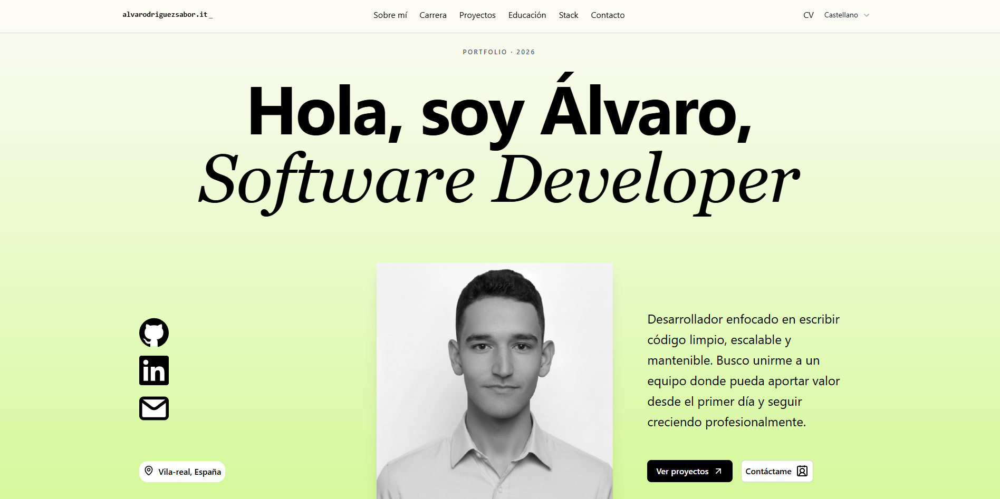
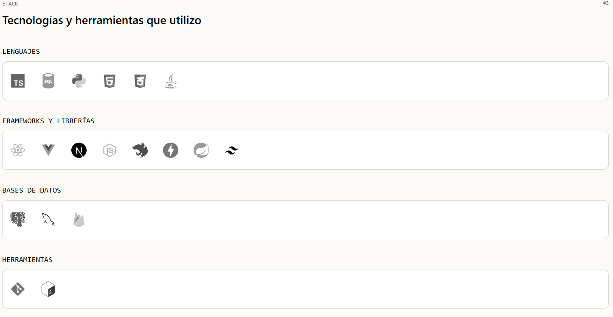
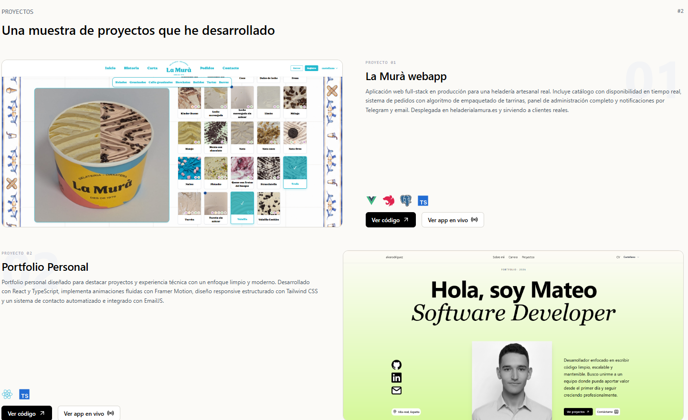
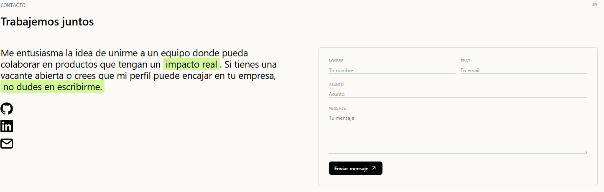

# Álvaro Rodríguez Saborit - Portfolio

Portfolio personal construido con React, TypeScript y Tailwind CSS. Diseñado como una single-page application con navegación por secciones, animaciones de scroll, soporte multilingüe (ES/EN/VA) y formulario de contacto funcional.



🔗 **[Ver en vivo →](https://alvarodriguezsabor.it)**

---

## Secciones

| Sección         | Descripción                                                                                 |
| --------------- | ------------------------------------------------------------------------------------------- |
| **Hero**        | Presentación con foto, enlaces sociales (GitHub, LinkedIn, email) y degradado animado       |
| **Trayectoria** | Experiencia profesional con timeline vertical                                               |
| **Proyectos**   | Tarjetas con layout alternado, iconos de stack y enlaces a código/demo                      |
| **Educación**   | Formación académica                                                                         |
| **Stack**       | Tecnologías organizadas por categoría (lenguajes, frameworks, bases de datos, herramientas) |
| **Contacto**    | Formulario con envío de email vía EmailJS + auto-reply al remitente                         |

---

## Stack del proyecto

- **React 19** + **TypeScript** - SPA con componentes tipados
- **Tailwind CSS 4** - Estilos utility-first, diseño responsive mobile-first
- **Framer Motion** - Animaciones de entrada, hover y scroll (vía `motion/react`)
- **i18next** - Internacionalización en español, inglés y valenciano
- **EmailJS** - Envío de formulario de contacto sin backend
- **Lucide React** - Iconografía
- **Vite** - Bundler y dev server

---

## Estructura del proyecto

```
src/
├── assets/              # Imágenes y recursos estáticos
├── components/
│   ├── Carrer/          # Timeline de experiencia profesional
│   ├── Contact/         # Formulario de contacto + inputs
│   ├── Education/       # Tarjetas de formación
│   ├── Projects/        # Tarjetas de proyectos + datos
│   ├── Stack/           # Grid de tecnologías + iconos
│   ├── TopBar/          # Navbar fija con barra de progreso de scroll
│   ├── ui/              # Componentes genéricos (Toast)
│   ├── SocialLink.tsx   # Enlace social con animación de texto
│   └── SocialLinksList.tsx
├── i18n/                # Archivos de traducción (es, en, va)
├── icons/               # Componentes SVG de cada tecnología
├── sections/            # Secciones principales de la página
│   ├── Hero.tsx
│   ├── Carrer.tsx
│   ├── Projects.tsx
│   ├── Education.tsx
│   ├── Stack.tsx
│   └── Contact.tsx
├── App.tsx              # Layout principal con navegación por anclas
└── main.tsx             # Entry point
```

---

## Ejecutar en local

```bash
git clone https://github.com/AlvaRodriguezSaborit/alvarodriguezsaborit-portfolio.git
cd alvarodriguezsaborit-portfolio
npm install
```

Crea un archivo `.env` en la raíz con tus credenciales de EmailJS:

```env
VITE_EMAILJS_SERVICE_ID=tu_service_id
VITE_EMAILJS_PUBLIC_KEY=tu_public_key
VITE_CONTACT_TEMPLATE_ID=tu_template_contacto
VITE_AUTOREPLY_TEMPLATE_ID=tu_template_autoreply
```

```bash
npm run dev
```

La app estará disponible en `http://localhost:5173`.

---

## Capturas

| Stack                     | Proyectos                        | Contacto                       |
| ------------------------- | -------------------------------- | ------------------------------ |
|  |  |  |

---

## Licencia

Este proyecto está bajo la Licencia MIT - mira el archivo [LICENSE](LICENSE) para más detalles.
